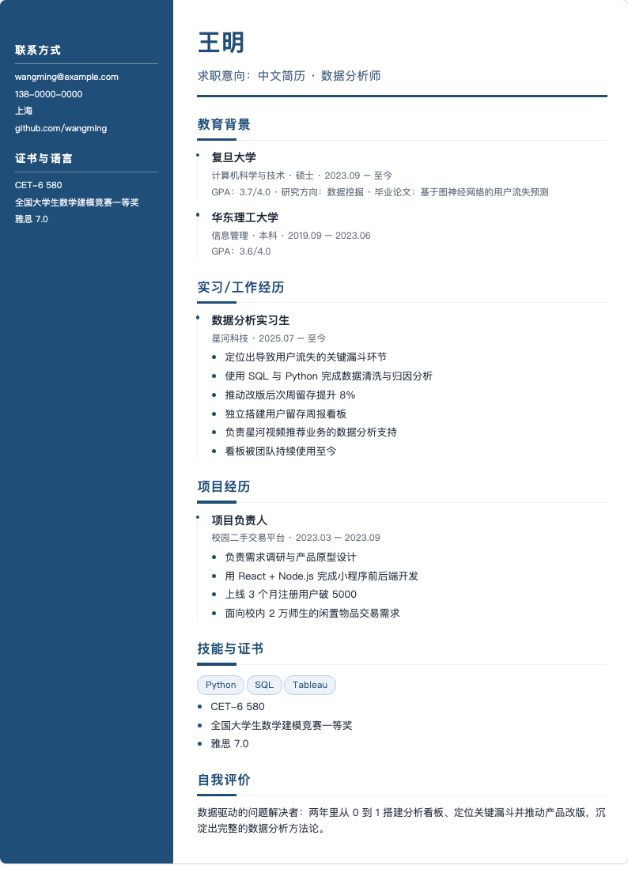

# ResumeAgent — An Evidence-Driven Multi-Agent Resume Mentor

**English** · [中文](README.md) · [日本語](README.ja.md)

> Instead of writing fancy copy for you, ResumeAgent interviews you like a real mentor: it asks about what you actually did — background, actions, methods, results — and only after you confirm the extracted facts does anything reach your resume. It then renders a polished, template-based resume and exports it as PDF.

<p align="center">
  
  <br/>
  <em>Left: guided Q&A with evidence progress · Right: live resume preview (two-column layout)</em>
</p>

<p align="center">
  
  <br/>
  <em>Final rendered resume (synthetic sample data)</em>
</p>

---

## The Problem

The hardest part of writing a resume is not layout — it's articulating what you did. Most people can only write "responsible for data analysis" with no context, actions, or results.

ResumeAgent inverts the workflow: **interview first, then render**.

1. You state a target role (e.g., "Data Analyst").
2. The mentor analyzes what that role demands, then asks questions one at a time in a popup — every question ships with **clickable candidate answers** ("换一批" / regenerate passes the rejected batch back to the model as negative examples).
3. Your answers are distilled into **candidate facts**; only facts you confirm enter the fact base.
4. Facts are organized across **six evidence dimensions**: context, responsibility, action, method, result, evidence. A quality gate requires ≥4 dimensions including action plus result/evidence.
5. The resume is assembled in the standard order (basics → objective → education → work experience → projects → skills & certificates → self-summary), rendered in a two-column themed layout, and exported as HTML / Markdown / DOCX / PDF.

You can stop anytime — "答完了，就用这些" (I'm done) keeps whatever you confirmed.

## Key Architecture Decisions

### Deterministic skeleton, LLM for candidates only (hallucination control)

- **When to ask, which dimension to ask, what may enter the resume, version isolation, rendering** — all deterministic code (questionnaire engine, dimension planner, quality gate, renderer).
- **LLMs only propose**: candidate facts, questions, options, self-summary variants.
- Facts require explicit user confirmation; self-summaries pass a grounding check (no numbers/companies/titles beyond the facts).
- Every LLM path has an offline fallback; the flow never breaks when the model is down.

### Six-dimension evidence model

Each experience stores evidence across `context / responsibility / action / method / result / evidence`. The planner ranks the next gap by severity × job relevance × distinctiveness × answerability × fatigue.

### Nine specialized agents (HelloAgents)

Fact auditing, question writing, job analysis, experience/role/follow-up option generation, course recommendation, skill extraction, self-summary and snippet writing — each with typed I/O contracts and offline fallbacks.

### Template system

- Three themed two-column layouts;
- School **HTML templates** with placeholders (`{{education}} {{experience_work}} ...`);
- **Form-PDF templates**: AcroForm fields (name, phone, school, …) are auto-detected, matched, and filled — exported directly as the school's layout;
- Photo upload; GPA/rank/research/thesis/certificates/language scores;
- School search with pinyin-initial fuzzy matching (180+ Chinese and 90+ overseas institutions).

## Tech Stack

| Layer | Technology |
| --- | --- |
| Language | Python 3.12 |
| Web | FastAPI + Uvicorn |
| Validation | Pydantic v2 |
| Storage | SQLite (JSON payloads, optimistic concurrency) |
| Agents | HelloAgents (OpenAI-compatible; DeepSeek / Qwen / …) |
| Frontend | Vanilla HTML / CSS / JS (ES modules, zero build) |
| Documents | pypdf (form-PDF filling), python-docx, headless Chrome (PDF) |
| Deploy | Docker / Docker Compose / Caddy |

## Quick Start

Python 3.10+; PDF export needs Chrome/Edge.

```bash
python3 -m venv .venv
source .venv/bin/activate
pip install -e '.[agents]'
cp .env.example .env          # set LLM_API_KEY (OpenAI-compatible)
uvicorn resume_agent.api.main:app --reload
```

Open <http://127.0.0.1:8000/>. Without model config the app runs in offline mode with deterministic fallbacks.

Tests:

```bash
.venv/bin/python -m pytest -q          # 285 backend tests
node --test tests/web/*.test.mjs       # 25 frontend tests
```

## Public Deployment

```bash
cp .env.example .env && vim .env       # set keys; consider ACCESS_CODE=<passcode>
chmod +x deploy/deploy.sh && ./deploy/deploy.sh
```

See [deploy/README.md](deploy/README.md) for Docker deployment, backups, domain + HTTPS, and firewall setup.

## License

[MIT](LICENSE)
