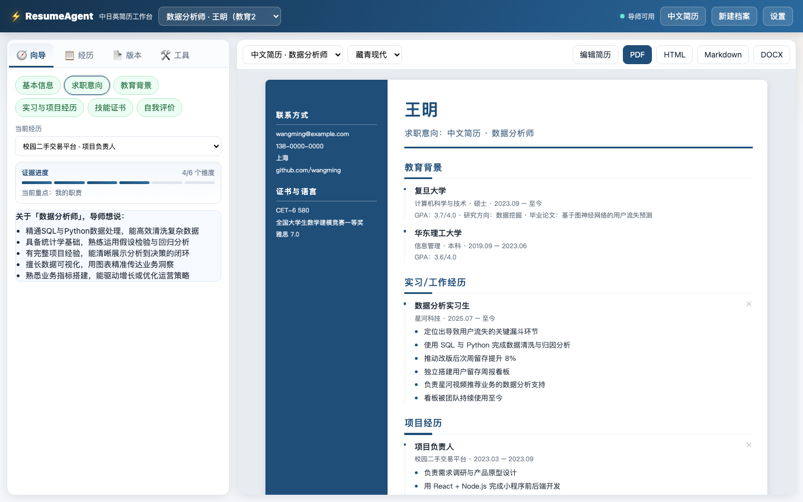

# ResumeAgent

**中文** · [日本語](README.ja.md) · [English](README.en.md)

ResumeAgent 是一个以证据为先的中日英简历导师。它不会先替你“写得更漂亮”，而是一次问一个问题，帮你回忆自己做过什么、分清个人贡献，并在你确认后才把事实写入简历。



## 它怎样工作

1. 选择一段真实经历，导师只追问当前最缺的一个证据维度。
2. 模型把回答整理成候选事实；你可以确认或拒绝，未确认内容不会进入简历。
3. 事实库按六个维度保存证据：背景、个人职责、行动、方法、结果、证明与数据。
4. 针对具体 JD 建立投递版本，选择要使用的经历和中文、日文或英文模板。
5. 在同一页面预览、编辑，并导出 HTML、Markdown、DOCX 或 PDF。

导师连续追问时会从直接提问逐步切换到回忆线索和替代证据；明确两次“暂时想不到”后会跳过该缺口。问题选择、确认规则、版本隔离和渲染由确定性代码控制，LLM 只承担候选事实抽取与问题措辞。

## 当前可用功能

- 白色双栏 FastAPI 工作台：访谈、事实库、JD 定制、工具与实时文档预览。
- 多档案、多经历和多投递版本；刷新页面后恢复当前会话、选择和服务端编辑稿。
- 六维证据进度与单问题访谈；候选事实支持确认、拒绝、估算和敏感标记。
- 只渲染已确认事实；事实库更新后会提示旧版本需要刷新。
- 中文、日文、英文的独立标题、版式和每语三套样式。事实内容不会被自动翻译。
- 可视化或 Markdown 编辑，并保存到服务端；可以随时恢复自动生成版本。
- HTML、Markdown、DOCX、PDF 导出，以及西历/和暦换算工具。
- 版本化的合成数据评测集，检查单问题、事实维度、证据保留和无幻觉等约束。

## 架构

```text
Browser (vanilla ES modules)
            │ same-origin JSON API
FastAPI ─── application services ─── deterministic planner / renderer
            │                              │
          SQLite                      HelloAgents adapters
     facts, sessions, versions       fact audit + question wording
```

默认 UI 没有前端构建步骤。SQLite 是本地事实、会话、版本和编辑稿的唯一持久化来源；渲染器只读取目标版本所选经历中的已确认事实。

主要目录：

```text
resume_agent/api/             FastAPI 入口与接口
resume_agent/application/     访谈、事实库与版本用例
resume_agent/domain/          领域模型和六维质量门槛
resume_agent/agents/          HelloAgents 适配器与提示词
resume_agent/rendering/       三语模板与导出器
resume_agent/web/             原生 HTML/CSS/JavaScript 工作台
tests/                        Python 与浏览器客户端测试
evaluation/                   合成导师评测数据与报告目录
```

## 快速开始

要求 Python 3.10+。只有 PDF 导出额外需要本机安装 Google Chrome 或 Microsoft Edge。

```bash
python3 -m venv .venv
source .venv/bin/activate
pip install -e '.[agents,web]'
cp .env.example .env
uvicorn resume_agent.api.main:app --reload
```

打开 <http://127.0.0.1:8000/>；OpenAPI 文档位于 <http://127.0.0.1:8000/docs>。

`.env.example` 中是占位值。要启用导师访谈，请将它们替换为真实的 OpenAI 兼容模型配置；保留占位值或不提供配置时，应用会进入离线模式。

| 变量 | 用途 | 默认值 |
| --- | --- | --- |
| `LLM_MODEL_ID` | 模型 ID | 必填（导师模式） |
| `LLM_API_KEY` | API 密钥；也兼容 `DEEPSEEK_API_KEY` | 必填（导师模式） |
| `LLM_BASE_URL` | OpenAI 兼容 HTTP(S) 地址 | 必填（导师模式） |
| `LLM_TIMEOUT` | 请求超时秒数 | `60` |
| `LLM_TEMPERATURE` | 事实抽取温度 | `0.2` |
| `LLM_MAX_TOKENS` | 单次最大输出 token | `2048` |
| `RESUME_AGENT_DB` | SQLite 文件路径 | `data/resume_agent.db` |

模型配置只在服务端读取。启动应用不会自动请求模型；`GET /capabilities` 可查看导师与导出能力，但不会返回 API Key 或完整供应商地址。

## 测试

```bash
pip install -e '.[dev]'
.venv/bin/python -m pytest -q
node --test tests/web/*.test.mjs
```

配置模型后可运行合成导师评测：

```bash
resume-agent-eval --repeats 3 --fail-under 0.90
```

## 隐私与本地数据

- 默认数据保存在本机 SQLite；API Key 只存在于服务端环境变量。
- 浏览器存储只保留档案、经历、版本、语言和标签页等选择 ID，不保存回答、事实、编辑稿或 API Key。
- 用于处理简历内容的 HelloAgents 实例默认关闭 trace、session、skills、todo、devlog 和 subagent 持久化。
- 仓库忽略 `.env`、SQLite 数据库、虚拟环境和本地缓存。提交或分享前仍应自行检查导出文件中的个人信息。

## 当前限制

- 这是本地单用户 MVP，没有托管服务、登录鉴权、多用户权限或云端数据隔离。不要直接暴露到公网。
- 导师提问和候选事实抽取需要可用的 LLM；没有 LLM 时，档案、事实、版本、预览、编辑和导出仍可离线使用。
- 三语模板会本地化文档结构和标题，但不会自动翻译已确认事实；投递前需要自行提供或核对目标语言内容。
- 日文 Web 版当前生成 `職務経歴書`。包含个人资料、照片、学历和资格字段的完整 JIS `履歴書` 尚未建模。
- PDF 导出依赖本机 Chrome 或 Edge；缺少浏览器时，HTML、Markdown 与 DOCX 不受影响。
- 当前没有已有简历的 PDF/DOCX 导入、团队协作或生产部署配置。

## 开源来源与许可证

本项目最初作为 [Datawhale HelloAgents](https://github.com/datawhalechina/hello-agents) 教程共创项目开发，现作为可独立运行的作品继续维护。

本项目沿用教程上游的 [CC BY-NC-SA 4.0](LICENSE) 许可证，并保留原项目署名。
